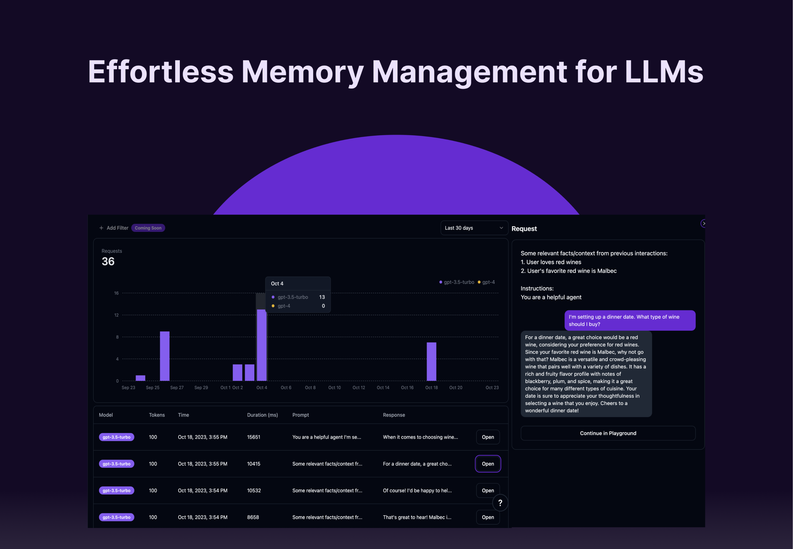
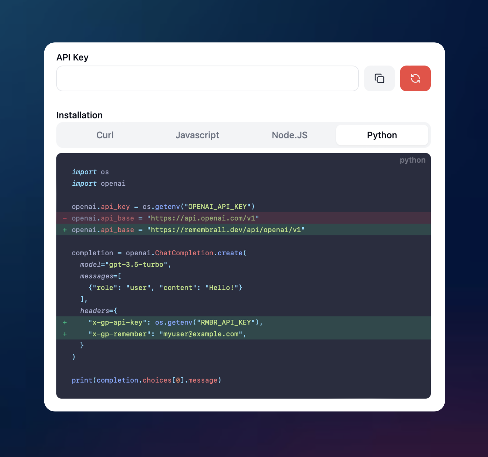
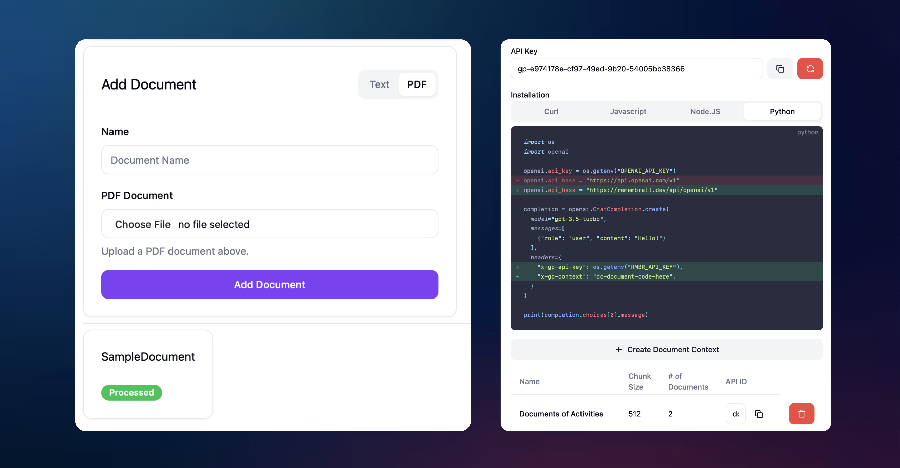

<h1 align="center">
    
</h1>

## Overview
Remembrall is a powerful API that enables long term memory for your LLM applications. Our platform allows you to enrich your existing LLM calls with key context from prior user chats and relevant documents – all with only two lines of code. 

You can sign up and get started today at https://remembrall.dev. 

## Features

    
&nbsp;
    

    
&nbsp;
    

 

## Getting Started:

You can get started immediately by signing up at https://remembrall.dev/dashboard. The web app features a playground where you can send messages with user memory and document contexts. All requests and any retrieved context can be viewed in the dashboard.

To integrate user memory into your application, simply navigate to Spells page, where you’ll find instructions for how to change your base API path and add headers with your Remembrall API key and user ID. Memories are stored and retrieved according to this user ID, and you’re able to pass in any identifier such as an email or session token. This tab also exposes and allows you to edit the memory instructions so you can tailor what is stored based on your use case. 

<h1 align="center">
    
</h1>

The Spells page also allows you to upload Document Contexts, which are clusters of documents that are chunked and retrieved when they’re relevant. To create a new Document Context, navigate to the Document Context tab, click “Create Document Context”, add all relevant files, and then paste the API ID for that cluster in your header per the instructions. 

<h1 align="center">
    
</h1>

Remembrall is also open sourced for use through an AGPL license, and you can clone it to run locally. If you have a use case that requires an enterprise license, please reach out to us at founders@reducto.ai.

## Help Shape our Development:

Remembrall is still an early stage product, and we really believe there’s a lot more we can build to supercharge LLM developers. If you have questions about the product, requests for features you’d like to see, or feedback you want to share with us, please join our Discord and reach out!
