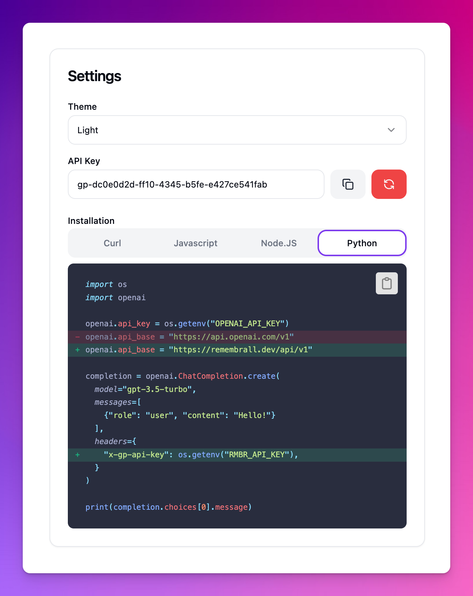
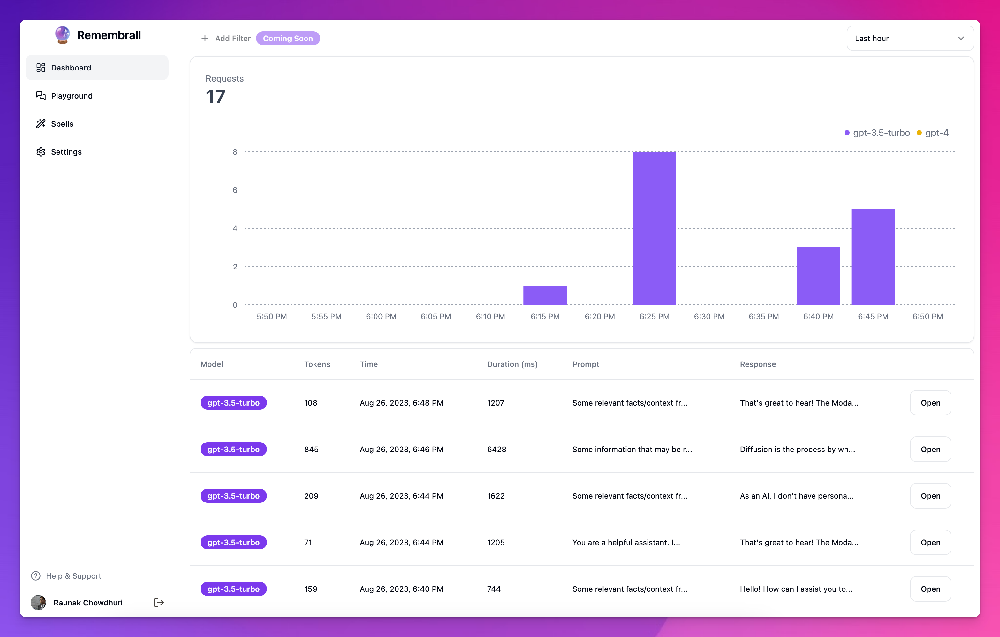

<h1 align="center">
    
</h1>

## Video Demo
https://youtu.be/szRWfolOx84

## Integrate in Seconds

## All in One Dashboard

Site is live at https://remembrall.dev

You should be able to clone the app and run it locally without issues if you want though.

## Built With
- Modal (PDF to Text conversion)
- tinybird.co (real time analytics)
- shadcn/ui (UI starter kit)
- Next.js Edge Functions
- Tailwind CSS
- OpenAI Function Calling + Embeddings
